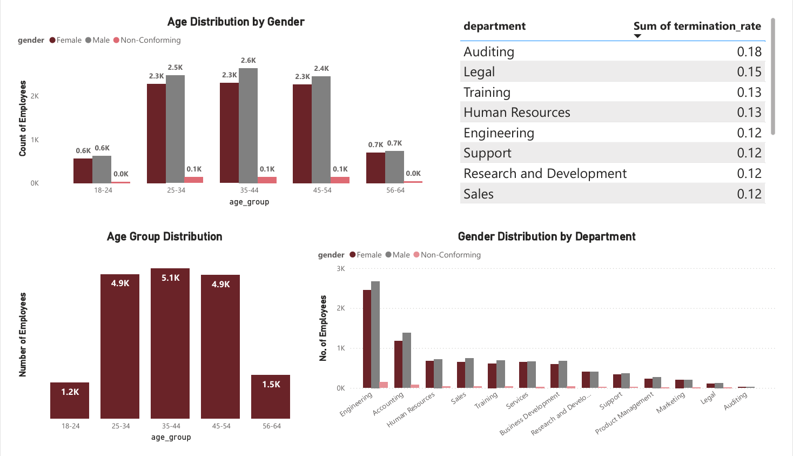

# HR Employee Distribution Dashboard | SQL + Power BI

This project presents an interactive Power BI dashboard developed using cleaned and transformed HR data to analyze employee demographics, diversity, geographical spread, and attrition trends. The objective is to deliver actionable insights for HR decision-making through effective data visualization and storytelling.

## 📁 Project Overview

The dashboard addresses key questions such as:

1. What is the gender breakdown of employees in the company?  
2. What is the race/ethnicity breakdown of employees?  
3. What is the age distribution of employees?  
4. How many employees work at headquarters vs. remote locations?  
5. What is the average length of employment for terminated employees?  
6. How does gender distribution vary across departments and job titles?  
7. What is the distribution of job titles across the company?  
8. Which department has the highest turnover rate?  
9. What is the distribution of employees by state?  
10. How has the employee count changed over time (hire vs. term date)?  
11. What is the tenure distribution per department?

## Tools Used

- Power BI  
- MySQL (Data Cleaning & Analysis)  
- Excel  

## Data Cleaning (via SQL)

- Calculated age from birthdates
- Removed employees under age 18
- Converted date fields to DATE format
- Cleaned termdate and created an active/inactive status
- Categorized age groups (18–24, 25–34, 35–44, etc.)

## Key Insights

- **Gender Distribution:** Male (8.9K), Female (8.1K), Non-Conforming (0.5K)
- **Remote Work:** 74.7% employees are remote, 25.3% at HQ
- **Race Breakdown:** Highest among White, Black, Asian, and Two or More Races
- **Age Groups:** Majority between 25–54 years
- **Top States:** Ohio, Illinois, Michigan
- **Department Turnover:** Highest in Auditing, Legal, and HR
- **Avg Tenure:** ~8 years

